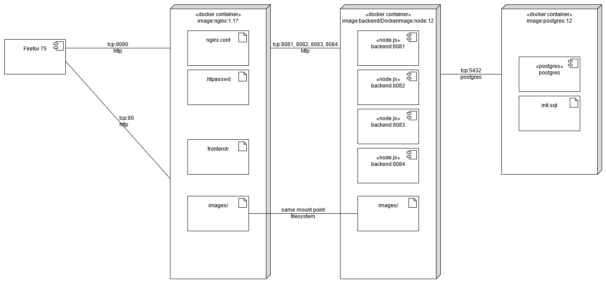
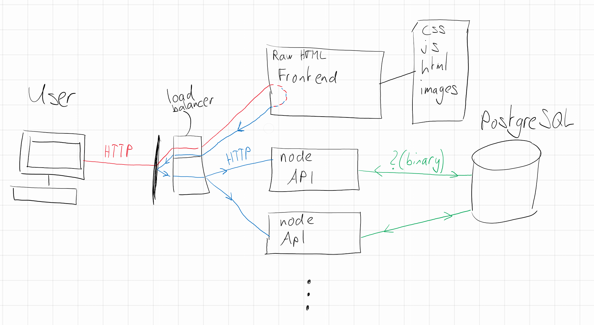

# vss_testat

*by [Felix Kubli](mailto:f1kubli@hsr.ch), [Patrick Kaufmann](mailto:pkaufban@hsr.ch) & [Marc Scherrer](mailto:mscherre@hsr.ch)*

[Mail an alle](mailto:f1kubli@hsr.ch,pkaufban@hsr.ch,mscherre@hsr.ch)

## Installation

```bash
git clone https://github.com/b000gt/vss_testat
cd vss_testat
docker-compose up -d
```

Grundsätzlich läuft alles über ``docker-compose``.
Man muss schauen dass docker-compose erst die Datenbank instanziert und danach erst die App laufen lässt. mit ``depends_on`` funktioniert das nicht richtig.

## Benutzung

Anmeldung erfolgt mit **username** ``hsr-user`` und **password** ``123456789``

Im ``images/examples`` Ordner finden Sie Beispielbilder. ``marc.jpg`` wird schon verwendet, die anderen können Sie zum hochladen benutzen.

Bilder sind aus [Unsplash](https://unsplash.com/s/photos/face)

## Erklärung

Über ``docker-compose.yml`` werden 3 Docker Images erstellt.





### nginx:1.17

In diesen Container werden 4 Sachen gemounted:

* nginx.conf
  * Dies ist die konfigurations Datei für nginx
* .htpasswd
  * Die passwort Datei für die basic authentication
* frontend/
  * index.html
  * script.js
  * style.css
* images/
  * Der Bilderordner. Wird zusammen mit dem Backend verwendet um die Bilder abzuspeichern

### postgres:12

Dieser Container wird mit environment Variables iniiziert.

```dockerfile
POSTGRES_USER: vss_user
POSTGRES_PASSWORD: '123456789'
POSTGRES_DB: happyface
```

gemounted wird ``init.sql`` um in der Datenbank das erste Bild und der erste click "Behälter" zu erstellen.

Die Daten werden unter postgres-data persistiert über die Laufzeit des Containers.

### backend/dockerfile

``FROM node:12``

In diesem Container wird die Applikation installiert und 4 mal auf 4 verschiedenen ports laufen gelassen:

package.json: 

```json
"system1": "node ./bin/www --port 8084",

"system2": "node ./bin/www --port 8081",

"system3": "node ./bin/www --port 8082",

"system4": "node ./bin/www --port 8083",

"start": "npm run system1 & npm run system2 & npm run system3 & npm run system4"
```

Gemounted wird hier auch der /images Ordner um die Bilder zu speichern.

Die Daten werden über den posrgres Container gespeichert.

